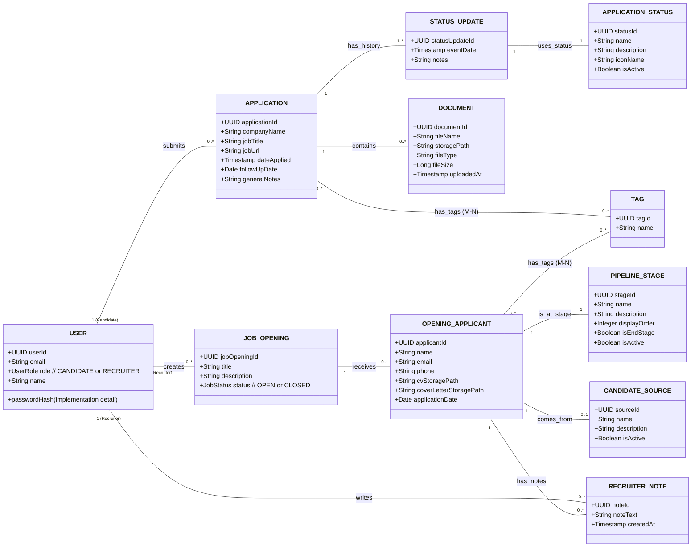

# 1. Introduction

Ce document présente le modèle conceptue pour l'application `CandiFlow`. Il identifie les principales entités métier, leurs attributs conceptuels clés, et les relations qui les lient, conformément aux spécifications définies. L'objectif est de fournir une compréhension claire de la structure des informations gérées par l'application.

## 2. Description Textuelle des Entités et Relations

**Entités Principales :**

- **USER :** Représente un utilisateur unique du système, identifié par un email et possédant un rôle défini (Candidat ou Recruteur).
- **APPLICATION :** Représente une candidature soumise par un `USER` (Candidat) pour un poste spécifique dans une entreprise. Contient les informations générales de la candidature.
- **STATUS_UPDATE :** Représente une étape datée dans le cycle de vie d'une `APPLICATION`, formant sa frise chronologique. Chaque étape utilise un statut prédéfini.
- **DOCUMENT :** Représente un fichier (CV, LM...) attaché à une `APPLICATION`.
- **JOB_OPENING :** Représente une offre d'emploi créée et gérée par un `USER` (Recruteur).
- **OPENING_APPLICANT :** Représente une personne (candidat) suivie par un `USER` (Recruteur) dans le contexte d'une `JOB_OPENING` spécifique. Contient les informations de contact et le statut du candidat pour cette offre précise.
- **RECRUITER_NOTE :** Une note spécifique prise par un `USER` (Recruteur) à propos d'un `OPENING_APPLICANT`.

**Entités de Référence (Codification) :**

- **APPLICATION_STATUS :** Définit les types de statuts possibles pour une `STATUS_UPDATE` (ex: 'Postulé', 'Entretien Technique').
- **PIPELINE_STAGE :** Définit les étapes possibles (colonnes Kanban) pour un `OPENING_APPLICANT` (ex: 'Nouveau', 'Présélection', 'Offre'). Inclut un ordre d'affichage.
- **CANDIDATE_SOURCE :** Définit les sources possibles d'un `OPENING_APPLICANT` (ex: 'LinkedIn', 'Cooptation').
- **TAG :** Définit un mot-clé ou une étiquette unique pouvant être associé(e) aux candidatures ou aux candidats suivis.

**Relations Principales (avec Multiplicités/Cardinalités) :**

- Un `USER` (avec rôle 'CANDIDATE') **soumet** `0..*` (zéro à plusieurs) `APPLICATION`s.
- Une `APPLICATION` **est soumise par** `1..1` (un seul) `USER` (Candidat).
- Une `APPLICATION` **possède** `1..*` (une à plusieurs) `STATUS_UPDATE`s (au minimum l'étape initiale).
- Un `STATUS_UPDATE` **appartient à** `1..1` (une seule) `APPLICATION`.
- Un `STATUS_UPDATE` **utilise** `1..1` (un seul) `APPLICATION_STATUS`.
- Un `APPLICATION_STATUS` **définit** `0..*` (zéro à plusieurs) `STATUS_UPDATE`s.
- Une `APPLICATION` **contient** `0..*` (zéro à plusieurs) `DOCUMENT`s.
- Un `DOCUMENT` **est lié à** `1..1` (une seule) `APPLICATION`.
- Un `USER` (avec rôle 'RECRUITER') **crée** `0..*` (zéro à plusieurs) `JOB_OPENING`s.
- Une `JOB_OPENING` **est créée par** `1..1` (un seul) `USER` (Recruteur).
- Une `JOB_OPENING` **reçoit** `0..*` (zéro à plusieurs) `OPENING_APPLICANT`s.
- Un `OPENING_APPLICANT` **concerne** `1..1` (une seule) `JOB_OPENING`.
- Un `OPENING_APPLICANT` **se trouve à** (`is at`) `1..1` (une seule) `PIPELINE_STAGE`.
- Un `PIPELINE_STAGE` **contient** `0..*` (zéro à plusieurs) `OPENING_APPLICANT`s.
- Un `OPENING_APPLICANT` **provient de** (`comes from`) `0..1` (zéro ou une) `CANDIDATE_SOURCE`.
- Une `CANDIDATE_SOURCE` **est l'origine de** `0..*` (zéro à plusieurs) `OPENING_APPLICANT`s.
- Un `OPENING_APPLICANT` **reçoit** `0..*` (zéro à plusieurs) `RECRUITER_NOTE`s.
- Une `RECRUITER_NOTE` **concerne** `1..1` (un seul) `OPENING_APPLICANT`.
- Une `RECRUITER_NOTE` **est écrite par** `1..1` (un seul) `USER` (Recruteur).
- Une `APPLICATION` **est associée à** `0..*` (zéro à plusieurs) `TAG`s (Relation Many-to-Many).
- Un `TAG` **est associé à** `0..*` (zéro à plusieurs) `APPLICATION`s (Relation Many-to-Many).
- Un `OPENING_APPLICANT` **est associé à** `0..*` (zéro à plusieurs) `TAG`s (Relation Many-to-Many).
- Un `TAG` **est associé à** `0..*` (zéro à plusieurs) `OPENING_APPLICANT`s (Relation Many-to-Many).

## 3. Diagramme Conceptuel (Mermaid Class Diagram)

